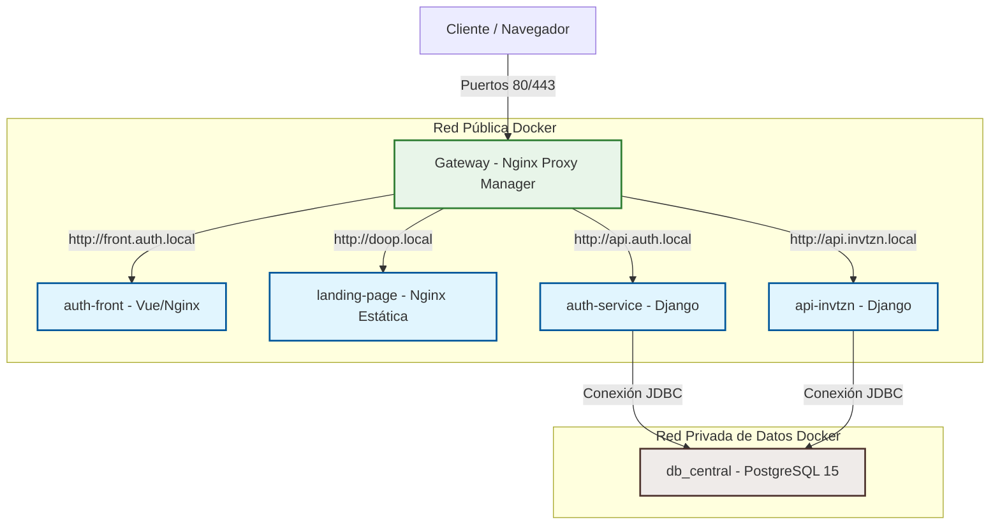

# ⚡ Ecosistema invtzn — Microservicios & Orquestación Local

Bienvenido al repositorio central de **invtzn**, un ecosistema modular de microservicios dockerizados de alto rendimiento diseñado para la gestión de invitaciones digitales, pasarelas de pago integradas, administración interna (CRM) y reconciliación financiera.

Este repositorio actúa como el orquestador del entorno de desarrollo local y define las directrices y estándares para el despliegue en entornos de producción.

---

## 🗺️ Mapa del Ecosistema y Arquitectura

El ecosistema está fragmentado en componentes especializados que se comunican a través de redes Docker aisladas (`red_publica` y `red_datos`). El punto de entrada unificado para el tráfico web y la terminación SSL (HTTPS) es un proxy inverso administrado localmente.



---

## 📦 Componentes del Ecosistema

| Componente | Directorio | Tecnología | Propósito |
| :--- | :--- | :--- | :--- |
| **Gateway** | `/gateway` | Nginx Proxy Manager | Proxy inverso, redirecciones y certificados SSL (Let's Encrypt). |
| **BD Central** | `/bd` | PostgreSQL 15 Alpine | Base de datos unificada para todo el ecosistema con aislamiento de esquemas. |
| **Auth Backend** | `/auth-service` | Django 5.2 (REST / JWT) | Gestión centralizada de usuarios, tokens JWT, perfiles y autenticación. |
| **Invitaciones API** | `/api-invtzn` | Django 6.0 | Lógica de negocio para invitaciones, eventos, ventas e integración con Stripe. |
| **Auth Frontend** | `/auth-front` | Vue.js 3 + Vite | Portal de administración de usuarios, CRM, POS y reconciliación. |
| **Landing Page** | `/landing-page` | HTML/CSS + Nginx | Página comercial estática de presentación para usuarios B2C. |

---

## 🛠️ Requisitos Previos

Antes de levantar el entorno local, asegúrate de tener instalado y configurado lo siguiente en tu sistema operativo:

1. **Docker & Docker Compose** (Docker Desktop en Windows/macOS o Docker Engine en Linux).
2. **Git** para control de versiones.
3. **Mapeo de DNS Locales:** Debes agregar las siguientes líneas al archivo `hosts` de tu sistema operativo para poder navegar por el ecosistema con nombres de dominio locales reales:

   * **Ruta en Windows:** `C:\Windows\System32\drivers\etc\hosts` (Abrir como Administrador)
   * **Ruta en Linux/macOS:** `/etc/hosts` (Abrir con `sudo`)

   **Líneas a añadir:**
   ```text
   127.0.0.1   api.invitazyon.local
   127.0.0.1   api.auth.local
   127.0.0.1   doop.local
   127.0.0.1   api.pos.local
   127.0.0.1   front.auth.local
   127.0.0.1   api.invtzn.local
   ```

---

## 🚀 Guía de Arranque Rápido (Desarrollo)

### Paso 1: Configurar Variables de Entorno
Crea una copia del archivo `.env.example` en la raíz del proyecto y nombrala `.env`:
```bash
cp .env.example .env
```
> [!IMPORTANT]
> Abre el archivo `.env` recién creado y reemplaza los valores de prueba por tus claves reales (por ejemplo, las credenciales de Stripe y tus contraseñas locales). Este archivo `.env` está en el `.gitignore` y **nunca** debe subirse a Git.

### Paso 2: Crear Redes Externas en Docker
Nuestros contenedores se comunican a través de dos redes externas compartidas. Debes crearlas manualmente una sola vez antes de levantar el compose:
```bash
docker network create red_publica
docker network create red_datos
```

### Paso 3: Levantar la Base de Datos Central
Accede al directorio de la base de datos y arranca el contenedor:
```bash
cd bd
docker compose up -d
```
> [!TIP]
> El contenedor de la base de datos incluye un script de inicialización automática en `bd/init-scripts/` que creará las bases de datos `auth_db_service` y `api_invtzn_db` con sus respectivos usuarios y privilegios de forma automática en el primer arranque.

### Paso 4: Levantar los Microservicios
Puedes levantar cada servicio de forma individual entrando en su directorio correspondiente y ejecutando:
```bash
docker compose up -d --build
```
*(Repite el proceso en `/auth-service`, `/api-invtzn`, `/auth-front`, `/landing-page` y `/gateway` según sea necesario)*.

### Paso 5: Configurar Nginx Proxy Manager (Gateway)
1. Abre tu navegador e ingresa a `http://localhost:81` (Panel de Administración de Nginx Proxy Manager).
2. **Credenciales por defecto:**
   * **Email:** `admin@example.com`
   * **Contraseña:** `changeme`
3. Configura tus **Proxy Hosts** para redirigir el tráfico local:
   * `front.auth.local` $\rightarrow$ Forward IP: `auth-front`, Puerto: `8080` (Cambiado a 8080 por endurecimiento de seguridad non-root)
   * `api.auth.local` $\rightarrow$ Forward IP: `auth-service-api`, Puerto: `8000`
   * `api.invtzn.local` $\rightarrow$ Forward IP: `invtzn-service-api`, Puerto: `8000`
   * `doop.local` $\rightarrow$ Forward IP: `landing-estatica`, Puerto: `80`

---

## 🛡️ Estándares y Despliegue en Producción

Para migrar este entorno local a un entorno de producción (ej. AWS EC2, GCP Compute Engine, Kubernetes), cada servicio cuenta con su propio archivo de configuración `docker-compose.prod.yml` descentralizado. Esto evita dependencias acopladas entre servicios y permite el despliegue y escalado independiente de cada módulo.

### Despliegue de un Servicio en Producción:
Accede al directorio del microservicio que deseas desplegar y arráncalo combinando las configuraciones:
```bash
docker compose -f docker-compose.yml -f docker-compose.prod.yml up -d --build
```

### Directrices de Producción Aplicadas:
* **Seguridad del Frontend (Non-Root & Puerto 8080):** El contenedor de `auth-front` compila utilizando Node LTS (`node:20-alpine`) y se sirve con `nginxinc/nginx-unprivileged:alpine` para evitar ejecución como root. Escucha en el puerto `8080`.
* **Vite Variables Dinámicas:** El build del frontend inyecta `VITE_API_AUTH_URL` y `VITE_API_INVTZN_URL` al compilar la imagen mediante argumentos `--build-arg`, evitando URLs hardcodeadas.
* **Optimización de PostgreSQL (Tuning):** El motor Postgres corre parametrizado para servidores de 1GB de RAM (`shared_buffers=256MB`, `effective_cache_size=768MB`, `work_mem=16MB`, etc.), previniendo saturación de hilos y picos de memoria.
* **Mitigación del Llenado de Disco (Rotación de Logs):** Todos los servicios productivos tienen configurado el logging driver `json-file` limitado a archivos de máximo 10MB con un historial rotatorio de 3 archivos.
* **Inmutabilidad:** Se desactiva el montaje de volúmenes en caliente (`.:/app`) en producción. El código final se empaqueta en la propia imagen Docker en la etapa de build.
* **Seguridad de Django:** Configurar `DEBUG = False`, generar claves secretas fuertes y restringir `CORS_ALLOWED_ORIGINS` y `ALLOWED_HOSTS` a través de variables inyectadas.
* **Seguridad JWT:** Habilitar `'JWT_AUTH_HTTPONLY': True` y `'JWT_AUTH_SECURE': True` en las cookies del backend.
* **Gateway Protegido:** El panel de Nginx Proxy Manager (puerto 81) se limita a `127.0.0.1` para ser accedido únicamente vía Túnel SSH o VPN.
* **Límites de RAM y CPU:** Cada contenedor tiene asignados límites de recursos (`deploy.resources.limits`) para asegurar la estabilidad del servidor host.
* **Copias de Seguridad (Backups):** Configurar un agente sidecar en la base de datos para respaldos diarios automatizados a un almacenamiento cloud.

---

## 🧪 Comandos Útiles

* **Ejecutar migraciones en Django (ej. en auth-service):**
  ```bash
  docker compose exec auth-service-api python manage.py migrate
  ```
* **Crear Superusuario:**
  ```bash
  docker compose exec auth-service-api python manage.py createsuperuser
  ```
* **Recopilar estáticos (WhiteNoise):**
  ```bash
  docker compose exec auth-service-api python manage.py collectstatic --noinput
  ```
* **Ver logs en tiempo real:**
  ```bash
  docker compose logs -f [nombre-servicio]
  ```
