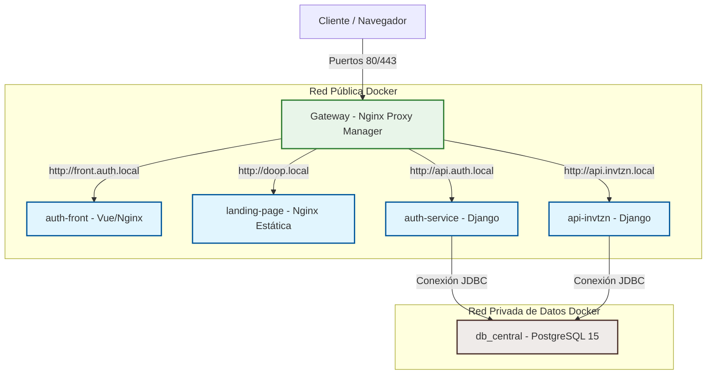

# ⚡ Ecosistema invtzn — Microservicios & Orquestación Local

Bienvenido al repositorio central de **invtzn**, un ecosistema modular de microservicios dockerizados de alto rendimiento diseñado para la gestión de invitaciones digitales, pasarelas de pago integradas, administración interna (CRM) y reconciliación financiera.

Este repositorio actúa como el orquestador del entorno de desarrollo local y define las directrices y estándares para el despliegue en entornos de producción.

---

## 🗺️ Mapa del Ecosistema y Arquitectura

El ecosistema está fragmentado en componentes especializados que se comunican a través de redes Docker aisladas (`red_publica` y `red_datos`). El punto de entrada unificado para el tráfico web y la terminación SSL (HTTPS) es un proxy inverso administrado localmente.



---

## 📦 Componentes del Ecosistema

| Componente | Directorio | Tecnología | Propósito |
| :--- | :--- | :--- | :--- |
| **Gateway** | `/gateway` | Nginx Proxy Manager | Proxy inverso, redirecciones y certificados SSL (Let's Encrypt). |
| **BD Central** | `/bd` | PostgreSQL 15 Alpine | Base de datos unificada para todo el ecosistema con aislamiento de esquemas. |
| **Auth Backend** | `/auth-service` | Django 5.2 (REST / JWT) | Gestión centralizada de usuarios, tokens JWT, perfiles y autenticación. |
| **Invitaciones API** | `/api-invtzn` | Django 6.0 | Lógica de negocio para invitaciones, eventos, ventas e integración con Stripe. |
| **Auth Frontend** | `/auth-front` | Vue.js 3 + Vite | Portal de administración de usuarios, CRM, POS y reconciliación. |
| **Landing Page** | `/landing-page` | HTML/CSS + Nginx | Página comercial estática de presentación para usuarios B2C. |

---

## 🛠️ Requisitos Previos

Antes de levantar el entorno local, asegúrate de tener instalado y configurado lo siguiente en tu sistema operativo:

1. **Docker & Docker Compose** (Docker Desktop en Windows/macOS o Docker Engine en Linux).
2. **Git** para control de versiones.
3. **Mapeo de DNS Locales:** Debes agregar las siguientes líneas al archivo `hosts` de tu sistema operativo para poder navegar por el ecosistema con nombres de dominio locales reales:

   * **Ruta en Windows:** `C:\Windows\System32\drivers\etc\hosts` (Abrir como Administrador)
   * **Ruta en Linux/macOS:** `/etc/hosts` (Abrir con `sudo`)

   **Líneas a añadir:**
   ```text
   127.0.0.1   api.invitazyon.local
   127.0.0.1   api.auth.local
   127.0.0.1   doop.local
   127.0.0.1   api.pos.local
   127.0.0.1   front.auth.local
   127.0.0.1   api.invtzn.local
   ```

---

## 🚀 Guía de Arranque Rápido (Desarrollo)

### Paso 1: Configurar Variables de Entorno
Crea una copia del archivo `.env.example` en la raíz del proyecto y nombrala `.env`:
```bash
cp .env.example .env
```
> [!IMPORTANT]
> Abre el archivo `.env` recién creado y reemplaza los valores de prueba por tus claves reales (por ejemplo, las credenciales de Stripe y tus contraseñas locales). Este archivo `.env` está en el `.gitignore` y **nunca** debe subirse a Git.

### Paso 2: Crear Redes Externas en Docker
Nuestros contenedores se comunican a través de dos redes externas compartidas. Debes crearlas manualmente una sola vez antes de levantar el compose:
```bash
docker network create red_publica
docker network create red_datos
```

### Paso 3: Levantar la Base de Datos Central
Accede al directorio de la base de datos y arranca el contenedor:
```bash
cd bd
docker compose up -d
```
> [!TIP]
> El contenedor de la base de datos incluye un script de inicialización automática en `bd/init-scripts/` que creará las bases de datos `auth_db_service` y `api_invtzn_db` con sus respectivos usuarios y privilegios de forma automática en el primer arranque.

### Paso 4: Levantar los Microservicios
Puedes levantar cada servicio de forma individual entrando en su directorio correspondiente y ejecutando:
```bash
docker compose up -d --build
```
*(Repite el proceso en `/auth-service`, `/api-invtzn`, `/auth-front`, `/landing-page` y `/gateway` según sea necesario)*.

### Paso 5: Configurar Nginx Proxy Manager (Gateway)
1. Abre tu navegador e ingresa a `http://localhost:81` (Panel de Administración de Nginx Proxy Manager).
2. **Credenciales por defecto:**
   * **Email:** `admin@example.com`
   * **Contraseña:** `changeme`
3. Configura tus **Proxy Hosts** para redirigir el tráfico local:
   * `front.auth.local` $\rightarrow$ Forward IP: `auth-front`, Puerto: `8080` (Cambiado a 8080 por endurecimiento de seguridad non-root)
   * `api.auth.local` $\rightarrow$ Forward IP: `auth-service-api`, Puerto: `8000`
   * `api.invtzn.local` $\rightarrow$ Forward IP: `invtzn-service-api`, Puerto: `8000`
   * `doop.local` $\rightarrow$ Forward IP: `landing-estatica`, Puerto: `80`

---

## 🛡️ Estándares y Despliegue en Producción

Para migrar este entorno local a un entorno de producción (ej. AWS EC2, GCP Compute Engine, Kubernetes), cada servicio cuenta con su propio archivo de configuración `docker-compose.prod.yml` descentralizado. Esto evita dependencias acopladas entre servicios y permite el despliegue y escalado independiente de cada módulo.

### Despliegue de un Servicio en Producción:
Accede al directorio del microservicio que deseas desplegar y arráncalo combinando las configuraciones:
```bash
docker compose -f docker-compose.yml -f docker-compose.prod.yml up -d --build
```

### Directrices de Producción Aplicadas:
* **Seguridad del Frontend (Non-Root & Puerto 8080):** El contenedor de `auth-front` compila utilizando Node LTS (`node:20-alpine`) y se sirve con `nginxinc/nginx-unprivileged:alpine` para evitar ejecución como root. Escucha en el puerto `8080`.
* **Vite Variables Dinámicas:** El build del frontend inyecta `VITE_API_AUTH_URL` y `VITE_API_INVTZN_URL` al compilar la imagen mediante argumentos `--build-arg`, evitando URLs hardcodeadas.
* **Optimización de PostgreSQL (Tuning):** El motor Postgres corre parametrizado para servidores de 1GB de RAM (`shared_buffers=256MB`, `effective_cache_size=768MB`, `work_mem=16MB`, etc.), previniendo saturación de hilos y picos de memoria.
* **Mitigación del Llenado de Disco (Rotación de Logs):** Todos los servicios productivos tienen configurado el logging driver `json-file` limitado a archivos de máximo 10MB con un historial rotatorio de 3 archivos.
* **Inmutabilidad:** Se desactiva el montaje de volúmenes en caliente (`.:/app`) en producción. El código final se empaqueta en la propia imagen Docker en la etapa de build.
* **Seguridad de Django:** Configurar `DEBUG = False`, generar claves secretas fuertes y restringir `CORS_ALLOWED_ORIGINS` y `ALLOWED_HOSTS` a través de variables inyectadas.
* **Seguridad JWT:** Habilitar `'JWT_AUTH_HTTPONLY': True` y `'JWT_AUTH_SECURE': True` en las cookies del backend.
* **Gateway Protegido:** El panel de Nginx Proxy Manager (puerto 81) se limita a `127.0.0.1` para ser accedido únicamente vía Túnel SSH o VPN.
* **Límites de RAM y CPU:** Cada contenedor tiene asignados límites de recursos (`deploy.resources.limits`) para asegurar la estabilidad del servidor host.
* **Copias de Seguridad (Backups):** Configurar un agente sidecar en la base de datos para respaldos diarios automatizados a un almacenamiento cloud.

---

## 📈 Analíticas y Telemetría Asíncrona (Fase 2)

Hemos diseñado e implementado una arquitectura de telemetría **self-hosted, no invasiva (cookie-free) y no bloqueante** para capturar métricas clave del sistema, junto con un motor dinámico de previsualización para redes sociales:

*   **Ingesta No Bloqueante:** El endpoint `/api/v1/deployments/slug/<slug>/metric/` encola las métricas en microsegundos y responde con un código `202 Accepted` de inmediato.
*   **Procesamiento Asíncrono (Celery + Redis):** Un broker de Redis (`redis:7-alpine`) recibe las tareas y los workers de Celery las procesan en segundo plano.
*   **Resolución Geográfica (GeoIP):** Los workers resuelven la ciudad y país a partir de la IP del cliente utilizando `ip-api.com` de forma asíncrona, evitando picos de latencia en la petición principal HTTP.
*   **Privacidad & GDPR Compliant:** Las IPs reales se enmascaran automáticamente en la base de datos para los dashboards visuales de los clientes (ej. `189.120.45.67` $\rightarrow$ `189.120.*.*`), cumpliendo con altos estándares de privacidad.
*   **Open Graph Dinámico (SEO & Social Share):** Implementamos un endpoint en `/api/v1/deployments/og/<slug>/` que renderiza cabeceras de Open Graph dinámicas:
    *   *Invitaciones Gratuitas:* Sirve una plantilla básica con un banner con marca de agua (`og-free-banner.png`).
    *   *Invitaciones Premium (Pagadas):* Genera previsualizaciones personalizadas con títulos, descripciones e imágenes específicas configuradas por el usuario.
*   **Intercepción de Bots en Nginx:** Configuramos la ruta `/i/<slug>` en el proxy reverso para interceptar a rastreadores de redes sociales (`facebookexternalhit`, `twitterbot`, `whatsapp`, `telegrambot`, etc.) mediante su User-Agent, redirigiéndolos sutilmente al renderizador de Open Graph en el backend, mientras que los usuarios normales son enviados directamente al frontend SPA de Vue.


---

## 🛒 Terminal Punto de Venta (POS) - Etapas 1, 2 y 3

Hemos diseñado e implementado una arquitectura de Punto de Venta (POS / TPV) robusta y de alto rendimiento para tiendas físicas y vendedores remotos, cubriendo tres etapas de reingeniería:

*   **Gestión de Cajas Físicas:** Restricción estricta de cobros en físico (Efectivo/Tarjeta) requiriendo una sesión de caja abierta (`CashSession`) asignada al vendedor y a la sucursal física. Las transacciones remotas ocultan de forma inteligente estos métodos presenciales.
*   **Búsqueda Avanzada de Clientes:** Buscador flexible e interactivo que permite filtrar perfiles de clientes registrados por ID, nombre completo, teléfono o correo electrónico. En caso de múltiples coincidencias, despliega un listado interactivo y autocompleta automáticamente el correo de envío del recibo en el checkout.
*   **Venta Multi-producto y Carrito Reactivo:** Carrito de compras que permite la agregación de múltiples productos (tanto físicos como digitales), control de cantidades, cálculo automático de impuestos (`tax_rate`) y subtotal.
*   **Control de Descuentos por Rol:** Los descuentos directos aplicados a nivel de orden se restringen a nivel de backend y de frontend exclusivamente a los roles `ADMIN` y `FRANCHISEE`. Los vendedores estándar tienen bloqueado este acceso.
*   **Asignación de Claves Seriales Digitales:** Entrega automatizada y segura en modo FIFO de licencias/claves digitales (`ProductSerialKey`). La asignación de seriales utiliza un bloqueo transaccional (`select_for_update`) a nivel de base de datos para evitar la colisión de claves concurrentes.
*   **Modo Offline Inteligente:** En caso de pérdida de red, el POS opera de forma local leyendo el catálogo desde `localStorage` y restringiendo cobros a efectivo (`CASH`). Las ventas se encolan secuencialmente y se sincronizan de forma transparente en segundo plano al recuperar la conexión.
*   **Impresión de Tickets Térmicos:** Formato minimalista de 80mm de ancho estilizado en tipografía `Courier` optimizado para impresoras térmicas de caja usando `window.print()` con fallback nativo a PDF.
*   **Recibos de Correo Asíncronos:** Plantilla premium y responsive enviada en segundo plano a través de Celery Workers para no interferir con la velocidad de la terminal de venta.
*   **Facturación CFDI 4.0 Simulado:** Formulario de facturación incorporado en el flujo post-venta alineado con las reglas de validación del SAT, con descarga directa de archivos XML y PDF mock.

---

## 🌐 E-commerce Storefront & Facturación SAT CFDI 4.0 - Etapas Básica y Avanzada

Hemos diseñado e implementado el canal de ventas digital B2C y el portal postventa para clientes finales, complementando el ecosistema híbrido digital-físico:

*   **Venta Híbrida y Multi-ítem:** Habilitado el soporte en backend (`OrderItem`) y frontend (`CheckoutView.vue` y Pinia) para procesar carritos de compra mixtos (invitaciones base + add-ons físicos o de servicios).
*   **Checkout Dinámico y Pasarela (Stripe):** Desglose en tiempo real del subtotal, impuestos y servicios seleccionados durante el flujo de pago con Stripe.
*   **Historial de Pedidos del Cliente ("Mis Pedidos"):** Creación de una interfaz responsiva premium en el dashboard del cliente para el seguimiento histórico de compras (Online y POS).
*   **Seguimiento Visual de Logística Física:** Barra de progreso interactiva (Pendiente ➔ En Producción ➔ Enviado ➔ Entregado) con enlaces de rastreo directo a paqueterías (FedEx/DHL) si el pedido contiene ítems físicos.
*   **Facturación SAT CFDI 4.0 Automatizada:** Timbrado y generación de facturas con Facturapi al finalizar la compra de manera exitosa, o de forma manual desde el dashboard mediante un formulario SAT integrado con validaciones (RFC, Régimen Fiscal, C.P., Uso de CFDI).
*   **Descargas y Reenvío de CFDIs:** Descarga directa de archivos XML y PDF de la factura desde el panel del cliente, con opción de reenvío asíncrono automatizado al correo del comprador mediante Celery Workers.
*   **Canal de Ayuda y Soporte:** Botón de contacto directo y pre-configurado hacia `soporte@invitazyon.online` para resolver incidencias postventa.

---

## 🎉 Cierre de la Versión 0.6.x (Motor de Cupones y Estabilización UI/UX)

La estabilización de la fase 0.6.x incorpora la unión definitiva entre las áreas B2C y B2B del ecosistema, eliminando silos de navegación y empoderando estrategias de marketing:

*   **Motor de Cupones B2C (Promociones):** Conexión total del modelo `Coupon` de Django al flujo de Checkout de Vue. Soporta validación de vigencia, límites máximos de uso, cálculo matemático de descuentos (fijos y porcentuales) y recalibración de pasarela de pagos (Stripe) en tiempo real.
*   **El Puente B2B Unificado:** Integración total del Layout de E-commerce B2C con el Navbar B2B, inyectando accesos directos al Punto de Venta (POS) para `ADMIN` y `FRANCHISEE`, eliminando componentes duplicados.
*   **Auditoría y Corrección UI/UX:** Limpieza agresiva de "botones fantasmas", asignación de lógica CRM interactiva en listados de usuarios, mejoras de rutas estrictas de Vue Router, e inyección de Mockups Premium 4K (Glassmorphism) para las áreas públicas.
*   **Redirección Continua (Cero Puntos Ciegos):** Tras un pago exitoso de una Plantilla, el sistema enruta directamente al usuario hacia la Suite de Diseño (`/studio`) con su nueva orden instanciada, evitando confusiones post-compra.

*   **Estabilización v0.6.3:** Resolución del 100% de bugs críticos del tester-1 (Interceptor Axios F5, links de registro correctos, RSVP básico a WhatsApp y flujos de previsualización con redirección directa de Stripe).

---

## 🛠️ Resolución de Bugs & Cierre Versión v0.6.3

La versión `v0.6.3` estabiliza el ecosistema resolviendo los problemas críticos reportados por QA y testers:

*   **Compatibilidad con Stripe SDK v15 (Error en Webhook):** Solución definitiva al error `AttributeError: get` al procesar el evento `checkout.session.completed` en el backend, convirtiendo el objeto `StripeObject` a un diccionario estándar mediante `.to_dict()` para acceder de manera segura a la metadata y el payment intent.
*   **Filtro de Rutas Públicas (Axios Interceptor):** Solución definitiva al error 401 en recargas (F5) en el catálogo público al omitir cabeceras de autorización en URLs relativas (`products` y `slug`).
*   **Aumento de Vida de Sesión JWT:** Incremento del tiempo de vida del access token a **1 día** en entornos locales/sandbox para mejorar la experiencia de depuración y desarrollo.
*   **Enlace de Registro y Rutas Corregidas:** Reparación del redireccionamiento roto a `/register` en el navbar (corregido a `/auth/registration/`).
*   **Bifurcación de Inicio de Diseño y Lienzos Básicos:** El flujo de "Comenzar a Diseñar" crea automáticamente un borrador básico con el producto digital base (`display_pcard = True`) o permite al usuario con invitaciones previas elegir entre continuar o crear una nueva.
*   **RSVP Básico por WhatsApp:** El bloque RSVP para invitaciones de plan Básico evita escrituras en la base de datos y redirige a los invitados directamente al WhatsApp del organizador (`whatsappPhone`).
*   **Flujo de Checkout Directo:** El botón "Comprar" en previsualización de borradores anónimos redirige directamente al checkout del producto base de la plantilla tras registrarse/iniciar sesión.
*   **Páginas Legales y Soporte:** Integración de rutas del footer a páginas estáticas de Términos (`/terminos`), Privacidad (`/privacidad`), Devoluciones (`/devoluciones`), Precios (`/precios`) y Ayuda (`/ayuda`).
*   **Imagen Hero Premium:** Generación e integración del banner visual `/hero_phone_invitation.png` mostrando la invitación de *Andrea y Joaquín*.

---

## 💎 Versión v0.7.0 — Separación de Flujos de Edición & Logs de Auditoría

La versión **v0.7.0** introduce un cambio estructural en el proceso de creación y edición, diferenciando entre flujos de consumo simplificados (Cliente A) y lienzos libres profesionales (Cliente B), sumado a robustez en la depuración:

*   **Cliente A (Catálogo - `CATALOG`):** Ruta `/builder/:id/form` que renderiza una interfaz de captura ágil de una sola columna (`CatalogFormView.vue`). Oculta el editor visual 3D. El botón de edición en el Dashboard desaparece automáticamente una vez que el cliente marca los datos como completos (`is_catalog_complete`).
*   **Cliente B (Lienzo Libre - `CANVAS`):** Acceso al editor visual completo (`StudioView.vue`) con bloqueos de componentes dinámicos en tiempo real según el nivel de suscripción del cliente.
*   **Bypass Dinámico de Sobre en Studio:** El sobre 3D (`EnvelopeWrapper`) solo se dibuja en la pestaña activa de "Sobre", optimizando la velocidad y reduciendo la fricción visual de edición.
*   **Sistema de Auditoría de logs (`SystemLog`):** Centraliza logs de eventos críticos (`USER_ACTION`, `DEPLOYMENT_STATE` y `PAYMENT_FLOW`) en el backend. Protegido rigurosamente para acceso exclusivo de `ADMIN` y superusuarios.
*   **DevTools Auditoría Real-Time:** Pestaña "Logs del Sistema" en DevTools para administradores, que renderiza la bitácora de logs con filtros de búsqueda y un visor modal para payloads y metadatos JSON.
*   **Administrador de Productos (`ProductsManagerView.vue`):** Interfaz exclusiva para administradores bajo `/workspace/products` para control del catálogo, precios base, stocks y configuraciones de tiers comerciales.
*   **Redirección Inteligente por Rol:** Seguridad a nivel de Vue Router para `/workspace`, dirigiendo automáticamente a `DESIGNER` a sus diseños y al resto del staff (`ADMIN`, `FRANCHISEE`, `MANAGER`, `VENDOR`) a la consola CRM comercial.

---

## 🧪 Comandos Útiles

### Desarrollo y Base de Datos
*   **Ejecutar migraciones en Django (ej. en auth-service):**
  ```bash
  docker compose exec auth-service-api python manage.py migrate
  ```
*   **Crear Superusuario:**
  ```bash
  docker compose exec auth-service-api python manage.py createsuperuser
  ```
*   **Recopilar estáticos (WhiteNoise):**
  ```bash
  docker compose exec auth-service-api python manage.py collectstatic --noinput
  ```
*   **Ver logs en tiempo real:**
  ```bash
  docker compose logs -f [nombre-servicio]
  ```

### Pruebas Unitarias e Integración (Backend y Frontend)
*   **Correr pruebas del Backend Principal (`api-invtzn`):**
  ```bash
  docker exec api-invtzn-invtzn-service-api-1 pytest
  ```
*   **Correr pruebas del Backend de Autenticación (`auth-service`):**
  ```bash
  docker exec auth-service-auth-service-api-1 pytest
  ```
*   **Correr pruebas del Frontend (`auth-front`):**
  ```bash
  # Desde la raíz de auth-front
  cmd.exe /c npx vitest run
  ```

### Monitoreo de Celery & Redis
*   **Ver logs en tiempo real del Celery Worker:**
  ```bash
  docker logs -f api-invtzn-celery-worker-1
  ```
*   **Ver estadísticas de la cola de Redis:**
  ```bash
  docker exec -it api-invtzn-redis-1 redis-cli info keyspace
  ```

---

## 💎 Versión v0.9.5 — Visualización en Vivo Dinámica por Roles y Traspaso de Propiedad

La versión **v0.9.5** refina la experiencia de previsualización en vivo (`/i/:slug`) protegiendo los borradores y simplificando la entrega de diseños personalizados por el staff hacia clientes finales:

*   **Control de Vista en Vivo por Roles (`DRAFT`):**
    *   **Invitados Finales (Externos/Anónimos):** Visualizan una pantalla premium con el mensaje *"¡Invitación en edición! El organizador está puliendo los detalles. Estará disponible públicamente muy pronto"*, previniendo la exposición de contenido incompleto o de botones de compra.
    *   **Cliente Propietario:** Visualiza la invitación completa acompañada del banner de *"MODO VISTA PREVIA"* y el botón flotante de *"Comprar"*.
    *   **Personal de la Plataforma:** Visualiza el diseño limpio de marcas de agua e inyecta una barra flotante en cabecera personalizada:
        *   `ADMIN` $\rightarrow$ `Modo Administrador | [Editar en Builder]`
        *   `DESIGNER` $\rightarrow$ `Modo Diseñador | [Editar en Builder]`
        *   `VENDOR` $\rightarrow$ `Modo Vendedor` (Solo lectura)
        *   `FRANCHISEE` $\rightarrow$ `Modo Franquicia` (Solo lectura)
*   **Traspaso de Propiedad al Pagar (Handoff Flow):**
    *   Si una invitación en borrador pertenece a un Administrador/Diseñador (creación de diseños a medida para un cliente) o es un sandbox anónimo (`dep.user is None`), el backend de órdenes (`sales/views.py`) transfiere la propiedad de forma automática al cliente comprador en el checkout (`dep.user = request.user.id`).
*   **Soporte Técnico de Diseñadores:**
    *   Cuando un Diseñador o Administrador asiste a un cliente en una invitación ya pagada (`LIVE`), el diseñador conserva acceso total de edición pero **la propiedad sigue perteneciendo al cliente**, evitando la pérdida de control del recurso.

